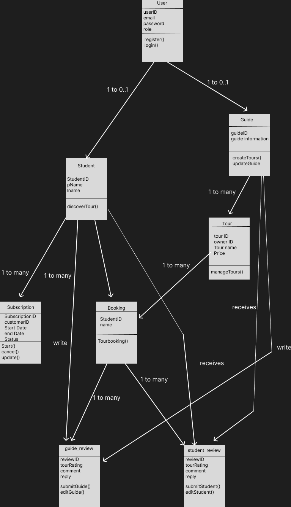

# SpartanGuide API – Spring Boot

Simple REST API for managing students, guides, tours, bookings, subscriptions, and reviews using Spring Boot.

## Requirements

- Java 25
- Maven Wrapper (mvnw or mvnw.cmd)
- VS Code (recommended)

## Setup

1. Clone the repository
2. Open the project in VS Code
3. Build the project

**Windows**
```
mvnw.cmd clean install
```

**Mac / Linux**
```
./mvnw clean install
```
## 3. UML Class Diagram



## Run the Application

1. Open main application class
2. Click Run → Start Debugging

The API will run at:

```
http://localhost:8080
```

## API Base URL

```
http://localhost:8080/api
```

## API Endpoints

### Students

**Base URL:** `/api/students`

- **Get all students** — `GET /api/students`
- **Get student by ID** — `GET /api/students/{id}`
- **Get student by email** — `GET /api/students/email/{email}`
- **Create student** — `POST /api/students`

Example:
```json
{
  "name": "Dylan Yank",
  "email": "dylan@example.com",
  "password": "MyUpdatedPass123!",
  "role": "STUDENT",
  "status": "ACTIVE",
  "major": "Software Engineering"
}
```

- **Update student** — `PUT /api/students/{id}`
- **Delete student** — `DELETE /api/students/{id}`

### Guides

**Base URL:** `/api/guides`

- **Get all guides** — `GET /api/guides`
- **Get guide by ID** — `GET /api/guides/{id}`
- **Get guide by email** — `GET /api/guides/email/{email}`
- **Create guide** — `POST /api/guides`

Example:
```json
{
  "name": "Jane Smith",
  "email": "jane.smith@sjsu.edu",
  "password": "securePassword123",
  "role": "GUIDE",
  "status": "ACTIVE",
  "bio": "Experienced campus guide."
}
```

- **Update guide** — `PUT /api/guides/{id}`
- **Delete guide** — `DELETE /api/guides/{id}`

### Tours

**Base URL:** `/api/tours`

- **Get all tours** — `GET /api/tours`
- **Get tour by ID** — `GET /api/tours/{id}`
- **Create tour** — `POST /api/tours`

Example:
```json
{
  "guide": { "guideId": 4 },
  "title": "Campus Highlights Tour",
  "location": "San Jose, CA",
  "description": "Guided campus tour.",
  "price": 29.99,
  "capacity": 20,
  "published": true
}
```

- **Update tour** — `PUT /api/tours/{id}`
- **Delete tour** — `DELETE /api/tours/{id}`

### Subscriptions

**Base URL:** `/api/subscriptions`

- **Get all subscriptions** — `GET /api/subscriptions`
- **Get subscription by ID** — `GET /api/subscriptions/{id}`
- **Get by student ID** — `GET /api/subscriptions/student/{id}`
- **Get by status** — `GET /api/subscriptions/status/{status}`
- **Create subscription** — `POST /api/subscriptions`

Example:
```json
{
  "planName": "Premium Tour Pack",
  "status": "ACTIVE",
  "startDate": "2026-03-20",
  "endDate": "2027-03-20",
  "autoRenew": true,
  "students": [{ "studentId": 1 }]
}
```

- **Update subscription** — `PUT /api/subscriptions/{id}`
- **Delete subscription** — `DELETE /api/subscriptions/{id}`

### Student Reviews (Guide → Student)

**Base URL:** `/api/student-reviews`

- **Get all reviews** — `GET /api/student-reviews`
- **Get by ID** — `GET /api/student-reviews/{id}`
- **Get by student** — `GET /api/student-reviews/student/{id}`
- **Get by guide** — `GET /api/student-reviews/guide/{id}`
- **Create review** — `POST /api/student-reviews`

Example:
```json
{
  "reviewer": { "guideId": 4 },
  "student": { "studentId": 1 },
  "rating": 5,
  "comment": "Great student."
}
```

- **Update review** — `PUT /api/student-reviews/{id}`
- **Delete review** — `DELETE /api/student-reviews/{id}`

### Guide Reviews (Student → Guide)

**Base URL:** `/api/guide-reviews`

- **Get all reviews** — `GET /api/guide-reviews`
- **Get by ID** — `GET /api/guide-reviews/{id}`
- **Get by guide** — `GET /api/guide-reviews/guide/{id}`
- **Get by student** — `GET /api/guide-reviews/student/{id}`
- **Create review** — `POST /api/guide-reviews`

Example:
```json
{
  "reviewer": { "studentId": 1 },
  "guide": { "guideId": 4 },
  "rating": 5,
  "comment": "Excellent guide."
}
```

- **Update review** — `PUT /api/guide-reviews/{id}`
- **Delete review** — `DELETE /api/guide-reviews/{id}`

### Bookings

**Base URL:** `/api/bookings`

- **Get all bookings** — `GET /api/bookings`
- **Get booking by ID** — `GET /api/bookings/{id}`
- **Get by student** — `GET /api/bookings/student/{id}`
- **Get by tour** — `GET /api/bookings/tour/{id}`
- **Create booking** — `POST /api/bookings`

Example:
```json
{
  "student": { "studentId": 1 },
  "tour": { "tourId": 2 },
  "paid": true
}
```

- **Update booking** — `PUT /api/bookings/{id}`
- **Delete booking** — `DELETE /api/bookings/{id}`

## Common Actions

- **Book a tour** — `POST /api/bookings`
- **Subscribe to a plan** — `POST /api/subscriptions`
- **Leave a review** — `POST /api/guide-reviews`
